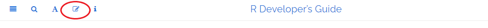

# Introduction

This guide is a comprehensive resource for contributing to base R^[The [set of packages](https://cran.r-project.org/doc/FAQ/R-FAQ.html#Add_002don-packages-in-R) in the base R distribution that are maintained by the R Core Team.] – for both new and experienced contributors. It is maintained by the [R Contribution Working Group](/working-group). We welcome your contributions to base R!

## Overview of different ways of contributing to the base R Project

Contributions to base R are possible in a number of different ways. Some of them are listed below:

1. Contributing to bug fixing: Refer [Bug Tracking](#BugTrack) and [Reviewing Bugs](#ReviewBugs).
2. Contributing to translations: Refer [Translations](#).
3. Testing R before release: Refer [Testing Pre-release R Versions](#TestRVer).

<!-- TODO(Saranjeet): Refer Contributing to R tutorial -->
<!-- TODO(Saranjeet): Welcome to Bug BBQ slides -->
<!-- TODO(Saranjeet): README on Bug BBQ repo -->

## Quick start to the guide

The guide is intended as a comprehensive resource for contributing to base R. The following chapter outline provides an overview with links to sections for getting started with contributing.

1. The [Introduction](#Introduction) chapter provides an overview of different ways of contributing to the base R project, a quick start to the guide, and a section on how to contribute to the guide itself.

2. The [R Patched and Development Versions](##GetStart) chapter covers instructions on how to install R from source or from binaries and also discusses the tools required to build R and R packages.

3. The [Issue Tracking](#IssueTrack) chapter mentions how contributors can support issue tracking in R, how get a Bugzilla account, how to navigate Bugzilla and search for bugs to contribute to.

4. The [Reporting Bugs](#ReportingBugs) chapter discusses what condition may or may not be a bug and how to report bugs if you find them.

5. The [Submitting Feature Requests](#FeatureRequests) chapter discusses how to submit feature requests and shares some examples of feature requests submitted ob Bugzilla.

6. The [Reviewing Bugs](#ReviewBugs) chapter discusses how you can make a contribution to reviewing bug reports.

6. The [Finding the Source](#FindSource) chapter provides an overview of the R codebase and helps with finding source code of base functions written in R and/or C.

7. The [Lifecycle of a Patch](#FixBug) chapter discusses how to create a patch to propose a bug fix.

8. The [Documenting](#Doc) chapter describes the format and style guide for help files in R, how to report and review issues in the existing documentation and how to propose changes.

9. The [Message Translations](#MessageTranslations) chapter covers internationalization in R, i.e., the display of messages in languages other than English.

10. The [Testing Pre-release R Versions](#TestRVer) discusses how you can help with testing of pre-release versions of R.

11. The [R Core Developers](#CoreDev) chapter contains a list of the former and current members of the R Core team who have write access to the R source.

12. For more information on how to engage with to community and ask for help, refer to the [Where to Get Help](#WhereToGetHelp) chapter.

13. To keep up with the developments in R refer to some of the resources available in the [News and Announcements](#News)

14. Resources and tools that may be relevant for R developers are available in the [Developer Tools](#DevTools) chapter.

## How to contribute to this guide itself? {#how-to-contribute-to-this-guide}

This guide is built using bookdown which makes editing it easier, provided you have a GitHub account (sign-up at [github.com](https://github.com/)). After you log-in to GitHub, click on the ‘Edit’ icon highlighted with a red ellipse in the image below. This will take you to an editable version of the the source R Markdown file that generated the page you are on:

Use the [issue tracker](https://github.com/r-devel/rdevguide/issues) to raise an issue about the guide’s content or to make a feature request.

Maintainers and contributors are requested to follow this project's [code of conduct](https://github.com/r-devel/rdevguide/blob/main/CONDUCT.md).

