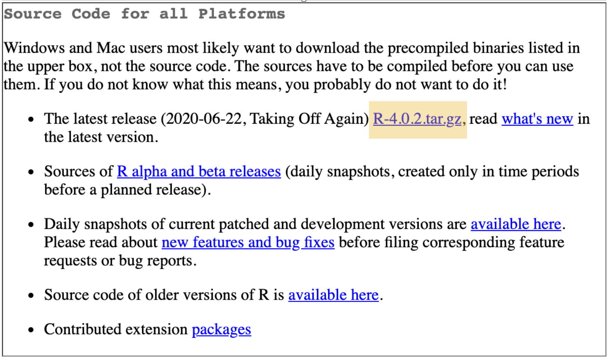

# Building R From Source

[TODO: A little intro Maybe talk about what SVN is and where R lives?]

:::note
Some note to the reader on how this will not overwrite R on their machine because right now I'm terrified that I'm going to break everything
:::

## Obtaining R

There are currently two ways to download the source code of R:

- From Source
- From git

### From Source

You can download the tr.gz from [CRAN](https://cran.r-project.org/mirrors.html). This link takes you to a list of CRAN mirrors (...what is a CRAN mirror?) where you can select one, then download R: 

```{r, out.width = '50%', out.height = '50%', echo=FALSE, fig.align='center'}

```

### From git

In this section we borrow from [Lionel Henry's Contributing to GNU R](https://bookdown.org/lionel/contributing/) where we clone R from Winston Chang’s [git mirror of the Subversion repository](https://github.com/wch/r-source.git), then tweak it a little to make building R easier.

:::note
In the code below Lionel uses `wget` which does not come installed on MacOS, but you can get it from Homebrew using `brew install wget`. 
:::

#### Clone the Repository
```
git clone https://github.com/wch/r-source.git
```

#### Add files

Lionel suggests importing 2 files that will make it easier to build R from the git clone, and creating a `.gitignore`:

#### `SVN-REVISION` file

In order to include the two files needed to build R, we need to first create a directory within our repo called `build`, then once we navigate inside the file we can add our two files. [TODO: What does the chmod line do?]

```
mkdir r-source/build
cd r-source/build

wget https://raw.githubusercontent.com/lionel-/contributing/master/inst/GNUmakefile
wget https://raw.githubusercontent.com/lionel-/contributing/master/inst/make-svn-revision

chmod +x make-svn-revision
```

#### .gitignore

In the root directory of r-source we'll make a self-referential `.gitignore` file, and add the folder we created above, as well as ignore any additional packages.

[TODO: I created this .gitignore in a text editor, then added the file called `.gitignore` to the `r-source` root directory.]

```
.gitignore
build/
src/library/Recommended/*gz
```

## Installing R

:::note
Installing R requires some dependencies which are listed with instructions to download based on operating system in the [Appendix](TODO).

-- THIS WILL GO IN APPENDIX --

1. `gcc`

  - mac: `brew install gcc`
  - linux: ``
  - windows: ``
 
2. why did I need to add `--with-pcre1` and Lionel didn't? Do I need to install something else?

    - mac: `--with-pcre1`
    - linux:
    - windows: 
  
3. `curl` 

  - mac:
    a. Do you have Anaconda installed remove it from your path Maybe a note also in the appendix about paths? Mine was nasty and someone helped me go from `/usr/local/opt/openssl/bin:/opt/local/bin:/opt/local/sbin:/usr/local/bin:/Users/mayagans/anaconda3/bin:/Users/mayagans/anaconda2/bin:/usr/local/bin:/usr/bin:/bin:/usr/sbin:/sbin:/opt/X11/bin:/Library/TeX/texbin/` to `/usr/local/bin:/usr/bin:/bin:/usr/sbin:/sbin:/opt/X11/bin:/Library/TeX/texbin/` How'd they know what to turn the path into? And what is like a smaller less confusing reprex than my messed up path
   
    b. Install inside the `build` folder and open it there:
   ```
   wget https://github.com/curl/curl/releases/download/curl-7_71_1/curl-7.71.1.tar.gz
  tar -xzvf curl-7_71_1.tar.gz
  cd curl-7.71.1
  ./configure --prefix=/opt/curl/7.71.1
  make
  make test
  make install
  export LD_LIBRARY_PATH=/opt/curl/7.71.1/lib:$LD_LIBRARY_PATH
   ```
  - windows:
  - linux
:::

Before we begin let's go over the files inside the downloaded repository: [TODO we might want to reorder these]

- `COPYING`		
- `Makeconf.in`	
- `README` - notes from The R Core team
- `configure.ac`	
- `m4`		
- `src`
- `ChangeLog`	
- `Makefile.fw`
- `VERSION`	
- `config.site`	
- `doc`
- `po`	
- `tests`
- `INSTALL`		
- `Makefile.in`	
- `VERSION-NICK`	
- `configure`	
- `etc`		
- `share`		
- `tools`

- `build` the folder we created in [Add Files](TODO) to configure our project. We build the project here because building in the root directory can cause a file mess which will be hard to add to the `.gitignore`.


### Unix

### Windows

### MacOS

We need to first install the reccomended packages which are inside the tools folder. In the root directory `r-source` we will run:

```
tools/rsync-recommended
```

Now we can navigate the to the `build` folder we created in [Add Files](TODO Link) and run

```
#!/bin/bash


# R recommends setting this to avoid issues with programs like sed:
export LANG=C

export R_ARCH=""

# Get version in major.minor format:
VERSION=`sed 's/\([0-9]*.[0-9]*\).[0-9]*.*/\1/' ../VERSION`

# Use version-dev as default folder target:
TARGET=${1:-$VERSION-dev}


# Download recommended packages
../tools/rsync-recommended

../configure \
    --enable-R-framework FW_VERSION=${TARGET} \
    --with-aqua=yes \
    --with-x=yes \
    --enable-memory-profiling \
    CFLAGS="-g -O0" && \
  make all && \
  make install
```

#### Environment Variables

```
../configure --help
```

The book talks about a couple - go over all these options in an appendix maybe? And more of a writeup on why you'd set some of these parameters and what they mean? 

## Running R


## Add on packages 
