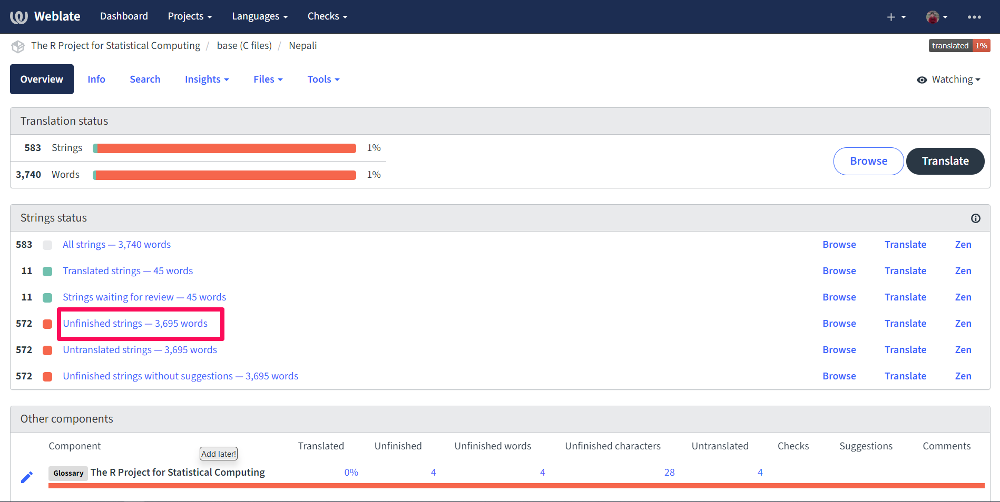

# Message Translations

This chapter covers internationalization in R, i.e., the display of
messages in languages other than English. All output in R (such as
messages emitted by `stop()`, `warning()`, or `message()`) is eligible
for translation, as are menu labels in the GUI. Depending on the version
of R that you are using, some of the languages might already be
available while others may need work. R leverages the
[`gettext`](https://www.gnu.org/software/gettext/) program to handle the
conversion from English to arbitrary target languages.

Having messages available in other languages can be an important bridge
for R learners not confident in English -- rather than learning two
things at once (coding in R and processing diagnostic information in
English), they can focus on coding while getting more natural
errors/warnings in their native tongue.

The [`gettext`
manual](https://www.gnu.org/software/gettext/manual/index.html) is a
more canonical reference for a deep understanding of how `gettext`
works. This chapter will just give a broad overview, with particular
focus on how things work for R, with the goal of making it as
low-friction as possible for developers and users to contribute
new/updated translations.

## How translations work

Each of the default packages distributed with R (i.e., those found in
`./src/library` such as `base`, `utils`, and `stats` and which have
priority base) contains a `po` directory that is the central location
for cataloguing/translating each package's messages.

### `.pot` files

The `.pot` file is a snapshot of the messages available in a given
**domain**. A domain in R typically identifies a source package and a
source language (either R or C/C++). For example, the file `R-stats.pot`
(found in the R sources in `./src/library/stats/po`) is a catalogue of
all messages produced by R code in the `base` package, while `stats.pot`
is a catalogue of all messages produced by C code in the `stats`
package.

There are two exceptions to the basic pattern described above. The first
is the domain for messages produced by the C code which is the
fundamental backing of R itself (especially, but not exclusively, the C
code under ./src/main). The associated `.pot` file is `R.pot` and it is
found in `./src/library/base/po`. `R-base.pot` is a normal `.pot` file
because base has a normal `R` directory.

The second is the domain for the Windows R GUI, i.e., the text in the
menus and elsewhere in the R GUI program available for running R on
Windows. These messages are stored in the `RGui.pot` domain, also in the
`po` directory for `base`, and are most commonly derived from C code
found in `./src/gnuwin32`. One reason to keep this domain separate is
that it is only relevant to one platform (Windows). In particular,
Windows has historically different character encodings, so that it made
more sense for Windows developers to produce translations specifically
for Windows, since it is non-trivial for non-Windows users to test their
translations for the Windows GUI.

#### Generating `.pot` files

For outside contributors, there's no need to update .pot files --
translators will typically take the R `.pot` files as given and generate
`.po` files. These will be sent along to a language-specific translation
maintainer, who then compiles them to send to the R Core developer
responsible for translations, who finally applies them as a patch.

To emphasize, this section is almost always not needed for contributing
translations -- it is here for completeness and edification.

### `.po` files

.po files are the most important artifacts for translators. They provide
the (human-readable!) mapping between the messages as they appear in the
source code and how the messages will appear to users in translated
locales.

#### Singular messages

Most messages appear as `msgid`/`msgstr` pairs. The former gives the
message as it appears in the code, while the latter shows how it should
appear in translation. For example, here is an error in German (locale:
`de`) informing the user that their input must be of class `POSIXt`

```         
msgid "'to' must be a \"POSIXt\" object"
msgstr "'to' muss ein \"POSIXt\" Objekt sein"
```

See this in context in the [`R-de.po` source
file](https://svn.r-project.org/R/trunk/src/library/base/po/R-de.po).

The same message can also be found in
[`R-it.po`](https://svn.r-project.org/R/trunk/src/library/base/po/R-it.po)
giving the translation to Italian:

```         
msgid "'to' must be a \"POSIXt\" object"
msgstr "'to' dev'essere un oggetto \"POSIXt\""
```

#### Plural messages

Some messages will have different translations depending on some input
determined at run time (e.g., the `length()` of an input object or the
`nrow()` of a `data.frame`). This presents a challenge for translation,
because different languages have different rules for how to pluralize
different ordinal numbers[\^See the [relevant
section](https://www.gnu.org/software/gettext/manual/html_node/Plural-forms.html)
of the `gettext` manual]. For example, English typically adds `s` to any
quantity of items besides 1 (1 dog, 2 dog`s`, 100 dog`s`, even 0
dog`s`). Chinese typically does not alter the word itself in similar
situations (一只狗, 两只狗, 一百只狗, 零只狗); Arabic has *six*
different ways to pluralize a quantity.

In `.po` files, this shows up in the form of `msgid_plural` entries,
followed by several ordered `msgstr` entries. Here's an example from
[`R-de.po`](https://github.com/r-devel/r-svn/blob/c715d61cb74b3fee2d035faed9b258e86e420b75/src/library/base/po/R-de.po#L2015-L2018):

```         
msgid "Warning message:\n"
msgid_plural "Warning messages:\n"
msgstr[0] "Warnmeldung:\n"
msgstr[1] "Warnmeldungen:\n"
```

The two entries in English correspond to the singular and plural
messages; the two entries in German correspond similarly, because
pluralization rules in German are similar to those in English. The
situation in Lithuanian
([`R-lt.po`](https://github.com/r-devel/r-svn/blob/c715d61cb74b3fee2d035faed9b258e86e420b75/src/library/base/po/R-lt.po#L1999-L2003))
is more divergent:

```         
msgid "Warning message:\n"
msgid_plural "Warning messages:\n"
msgstr[0] "Įspėjantis pranešimas:\n"
msgstr[1] "Įspėjantys pranešimai:\n"
msgstr[2] "Įspėjančių pranešimų:\n"
```

This corresponds to the 3 different ways to pluralize words in Polish.

What do `0`, `1`, and `2` correspond to, exactly? Ideally, this will be
clear to native speakers of the language, but for clarity, it is the
solution to a small arithmetic problem that can be found in the
language's metadata entry. Look for the `Plural-Forms` entry in the
metadata at the top of the `.po` file; [here it is for
Lithuanian](https://github.com/r-devel/r-svn/blob/c715d61cb74b3fee2d035faed9b258e86e420b75/src/library/base/po/R-lt.po#L18-L19):

```         
"Plural-Forms: nplurals=3; plural=(n%10==1 && n%100!=11 ? 0 : n%10>=2 && (n"
"%100<10 || n%100>=20) ? 1 : 2);\n"
```

`nplurals` tells us how many entries correspond to each `msgid_plural`
for this language. `plural` tells us, for the quantity `n`, which entry
to use. The arithmetic is C code; most important if you really want to
parse this and are only familiar with R code is C's [ternary
operator](https://en.wikipedia.org/wiki/%3F:):
`test ? valueIfTrue : valueIfFalse` is a handy way to write R's
`if (test) valueIfTrue else valueIfFalse`.

Parsing, we get the following associations:

-   the `0` entry corresponds to when a number equals 1 modulo 10 (i.e.,
    1, 11, 21, 31, ...) *except* numbers equaling 11 modulo 100 (i.e.,
    11, 111, 211, 311, ...). Combining, that's 1, 21, 31, ..., 91, 101,
    121, 131, ..., 191, ...
-   the `1` entry corresponds to numbers at least 2 modulo 10 (2, 3,
    ..., 8, 9, 12, 13, 14, ...) and *either* below 10 modulo 100 (0, 1,
    ..., 9, 100, 101, ..., 109, ...) *or* exceeding 20 modulo 100 (21,
    22, ..., 99). Combining, that's 2, 3, ..., 9, 22, 23, ..., 29, 32,
    33, ... 39, ..., 102, 103, ..., 109, 122, 123, ...
-   The `2` entry corresponds to all other numbers, i.e. 0, 10, 11, 12,
    ..., 19, 20, 30, ..., 90, 100, 110, 111, 112, ...

<!-- TODO(michaelchirico): How to discover a new `nplurals/plural`. -->

<!-- TODO(michaelchirico): sprintf templates (`%s`) and redirections (`%1$s`) -->

<!-- TODO(michaelchirico): fuzzy translations -->

### `.mo` files

`.po` files are plain text, but while helpful for human readers, this is
inefficient for consumption by computers. The .mo format is a "compiled"
version of the .po file optimized for retrieving messages when R is
running.

In R-devel, the conversion from .po to .mo is done by R Core -- you
don't need to compile these files yourself. They are stored in the R
sources at `./src/library/translations/inst` in various
language-specific subdirectories.

## How to contribute new translations

<!-- TODO(michaelchirico): Creating and editing .po files, testing the translations worked, **encoding**, translation teams, release schedule -->

Translating R into different languages helps make it more user-friendly
for non-English speakers and grow the R community. Also, read the blog
how [R can use your help: Translating R
message](https://blog.r-project.org/2022/07/25/r-can-use-your-help-translating-r-messages).

To get started with new translation, please follow the steps below:

Step 1: Register an Account at Weblate

Weblate is an open-source platform for collaborative translation of
software projects, including R. Register an account at
<https://translate.rx.studio/> to start contributing.

Step 2: Choose a Component and Language

Select a component of R with less than 100% translation. You can start
with sections like utils, base (R files), or tools (R files). Then you
can select your preferred language.


Step 3: Check String Status

Click on "Unfinished strings" to see the strings of messages that need
translation.

Here:

-   Translated Strings: Already translated.
-   Review Pending Strings: Translated strings awaiting review.
-   Untranslated/Incomplete Strings: Strings requiring translation.



Step 4: Translate the Message

Translate the message by typing the translation in the text box.


Click "Save and Continue" to save the translation and continue. The
translation team will review and integrate it into the R interface if it
meets the quality standards.

Related links:

<https://contributor.r-project.org/translating-r-to-your-language/>

## Current status of translations in R

<https://contributor.r-project.org/translations/>

## Helpful references

-   Statistical terms glossary
